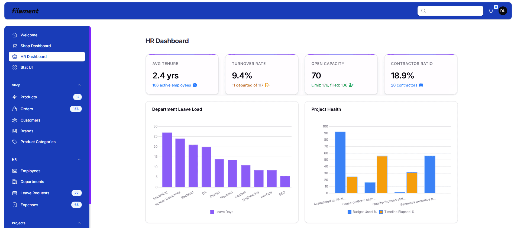
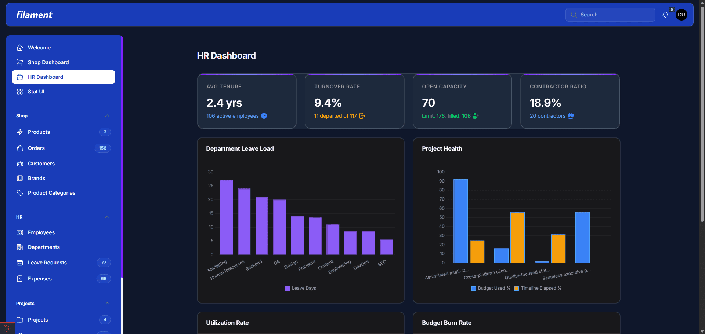
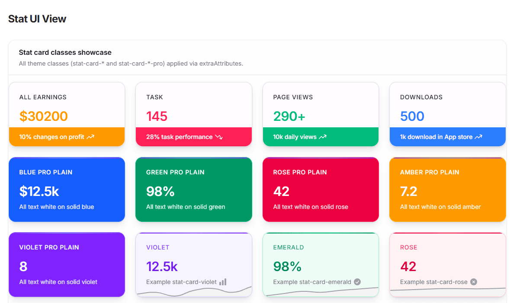
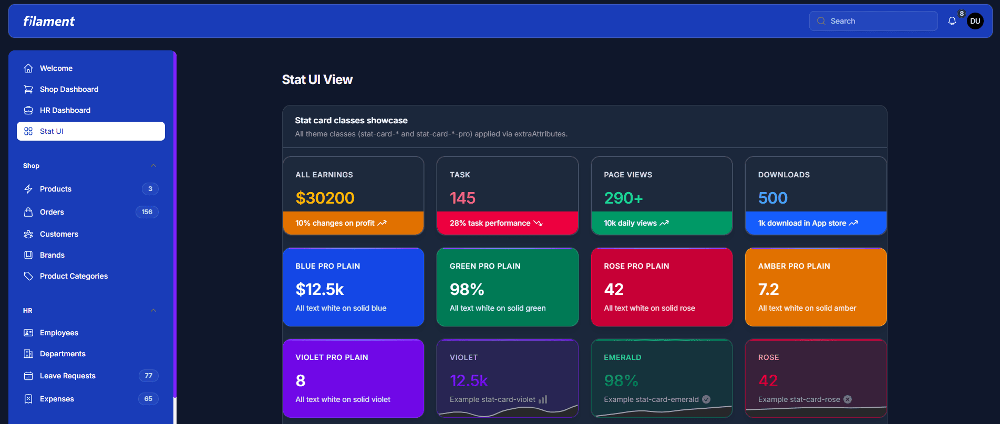
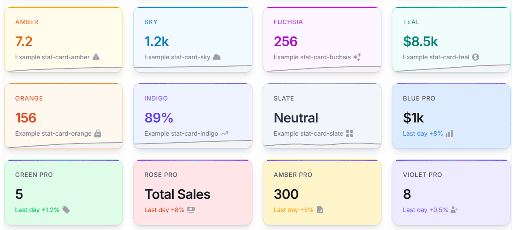
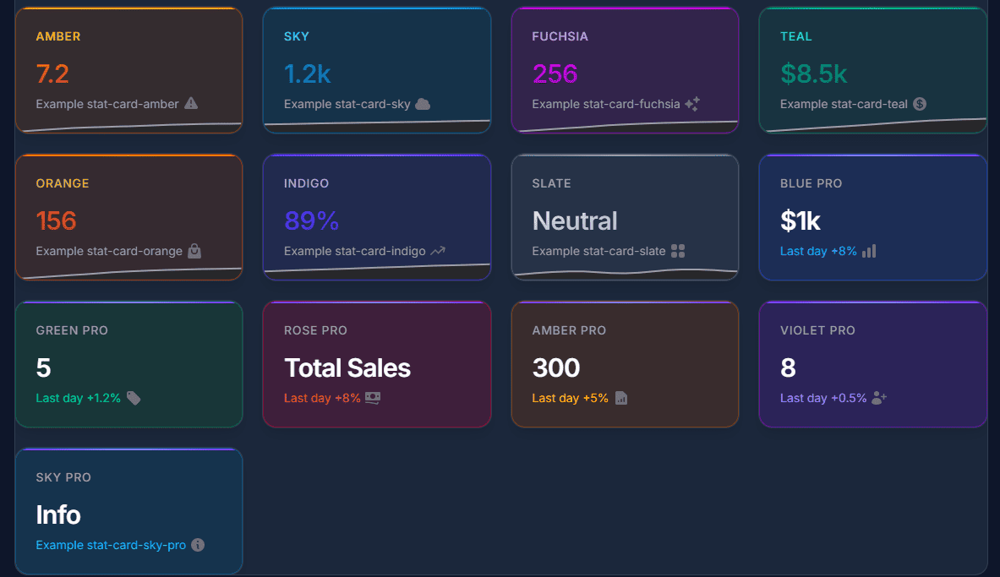
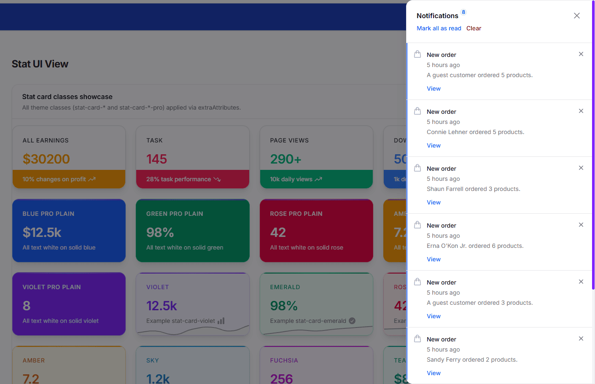
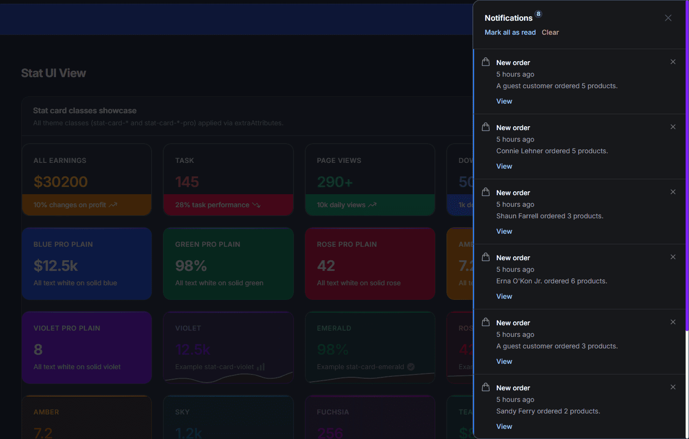
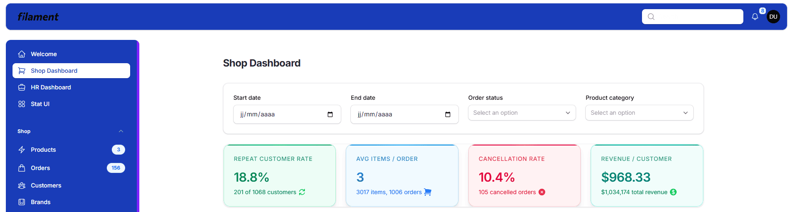
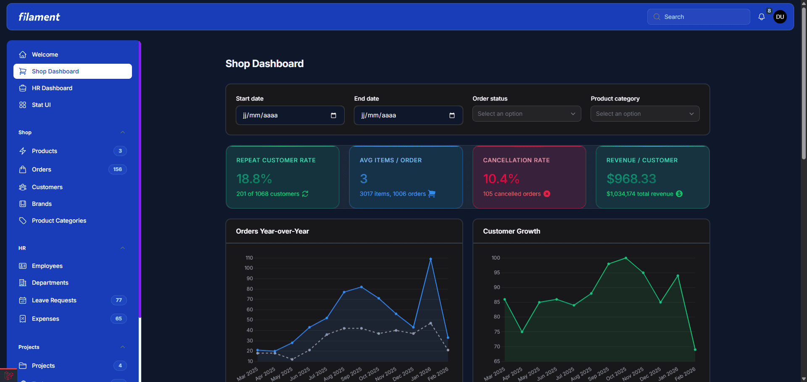

# TokeUI Theme for Filament


A professional Filament theme with a blue sidebar and topbar, plus a rich set of stat card styles. Compatible with Filament 4 and 5. Full light and dark mode support.

## Features

- Professional blue sidebar and topbar (same look in light and dark mode)
- Stat card variants: colored, pro, bar, and pro plain (use via `extraAttributes`)
- Full light and dark mode support
- Production ready; install via Composer and register the plugin

## Requirements

- PHP 8.2+
- Filament 4 or 5
- Laravel (version compatible with your Filament version)

## Installation

### 1. Activate your license (AnyStack)

TokeUI Theme uses [AnyStack](https://anystack.sh) for payment and distribution. [Purchase a license](https://anystack.sh) (use your TokeUI Theme product page URL once the product is created).

After purchase, AnyStack provides a license key. Use your account email and this key as Composer credentials (see below).

### 2. Install with Composer

Add the repository to the `repositories` section of your `composer.json`:

```json
{
    "repositories": [
        {
            "type": "composer",
            "url": "https://tokeui-filament-theme.composer.sh"
        }
    ]
}
```

Then install the package:

```bash
composer require tokeui/filament-tokeui-theme
```

When prompted, enter:
- **Username**: your email (the one associated with the license)
- **Password**: your AnyStack license key

### 3. Configure Vite

In your `vite.config.js`:

1. **Alias** (required so the theme can load Filament’s base CSS) — add to `resolve.alias`:

```js
import path from 'path';

export default defineConfig({
    resolve: {
        alias: {
            'filament-base-theme': path.resolve(__dirname, 'vendor/filament/filament/resources/css/theme.css'),
        },
    },
    // ...
});
```

2. **Input** — add the theme CSS file to the Laravel Vite plugin `input` array:

```js
input: [
    'resources/css/app.css',
    'resources/js/app.js',
    'vendor/tokeui/filament-tokeui-theme/resources/css/theme.css',
],
```

### 4. Build assets

```bash
npm run build
```

### 5. Register the plugin on your panel

In your panel provider (e.g. `app/Providers/Filament/AdminPanelProvider.php`):

```php
use TokeUI\FilamentTokeUITheme\FilamentTokeUIThemePlugin;

public function panel(Panel $panel): Panel
{
    return $panel
        // ...
        ->plugin(FilamentTokeUIThemePlugin::make());
}
```

If you were using a custom theme with `->viteTheme('resources/css/filament/admin/theme.css')`, remove it: the plugin registers the TokeUI theme via `viteTheme('vendor/tokeui/filament-tokeui-theme/resources/css/theme.css')`.

You’re all set.

---

## Stat Overview — extraAttributes and classes

Filament **Stats Overview** widgets let you add HTML attributes to stat cards via `->extraAttributes(['class' => '...'])`. TokeUI Theme provides predefined classes to style each card differently.

### Usage

On each `Stat` in your widget:

```php
use Filament\Widgets\StatsOverviewWidget\Stat;

Stat::make('Revenue', '$12.5k')
    ->description('This month')
    ->extraAttributes(['class' => 'stat-card-emerald']);
```

Use one class per card (e.g. `stat-card-rose` or `stat-card-blue-pro`).

### Available classes

#### Colored variants (gradient value, colored label)

| Class | Appearance |
|-------|------------|
| `stat-card-violet` | Pastel violet background, violet bar and value |
| `stat-card-emerald` | Green (success) |
| `stat-card-rose` | Rose / danger |
| `stat-card-amber` | Amber / warning |
| `stat-card-sky` | Sky blue / info |
| `stat-card-fuchsia` | Fuchsia |
| `stat-card-teal` | Teal |
| `stat-card-orange` | Orange |
| `stat-card-indigo` | Indigo |
| `stat-card-slate` | Neutral grey/slate |

#### “Pro” variants (pastel background, neutral value/label, accent on bar and description)

| Class | Appearance |
|-------|------------|
| `stat-card-blue-pro` | Pastel blue, neutral text, blue accent |
| `stat-card-green-pro` | Pastel green |
| `stat-card-rose-pro` | Pastel rose |
| `stat-card-amber-pro` | Pastel amber |
| `stat-card-violet-pro` | Pastel violet |
| `stat-card-sky-pro` | Pastel sky blue |

#### “Bar” variants (accent bar at bottom, white text in bar)

| Class | Appearance |
|-------|------------|
| `stat-card-bar-orange` | Orange value, orange bottom bar, white text in bar |
| `stat-card-bar-rose` | Rose |
| `stat-card-bar-emerald` | Emerald |
| `stat-card-bar-blue` | Blue |

#### “Pro plain” variants (solid background, all text white)

| Class | Appearance |
|-------|------------|
| `stat-card-blue-pro-plain` | Solid blue background, value/label/description in white |
| `stat-card-green-pro-plain` | Solid green |
| `stat-card-rose-pro-plain` | Solid rose |
| `stat-card-amber-pro-plain` | Solid amber |
| `stat-card-violet-pro-plain` | Solid violet |

---

## Screenshots / Appearance

The theme is shown below in both **light** and **dark** mode. All screenshots are in the `screenshots/` directory.

### 1 — Shop Dashboard

| Light | Dark |
|-------|------|
|  |  |

### 2 — HR Dashboard

| Light | Dark |
|-------|------|
|  |  |

### 3 — Stat UI View (stat card showcase)

| Light | Dark |
|-------|------|
|  |  |

### 4 — Stat cards grid (all theme classes)

| Light | Dark |
|-------|------|
|  |  |

### 5 — Notifications and stat cards

| Light | Dark |
|-------|------|
|  |  |

---

## License

Proprietary. Use is subject to the license purchased via AnyStack.
