# TokeUI Theme for Filament

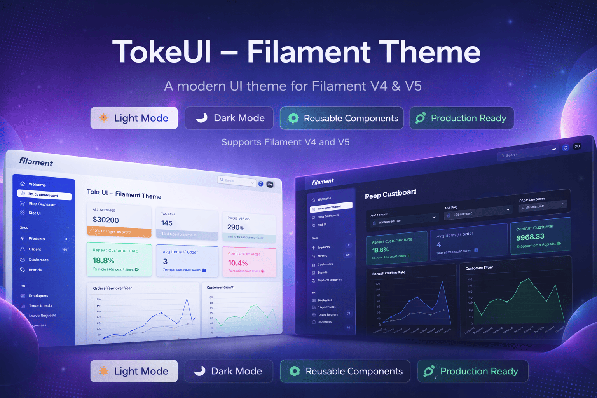

A professional Filament theme with a blue sidebar and topbar, plus a rich set of stat card styles. Compatible with Filament 4 and 5. Full light and dark mode support.

---

## Table of contents

- [Features](#features)
- [Requirements](#requirements)
- [How to get the theme](#how-to-get-the-theme)
- [Installation](#installation)
- [Stat Overview — extraAttributes and classes](#stat-overview--extraattributes-and-classes)
- [Screenshots / Appearance](#screenshots--appearance)
- [License](#license)

---

## Features

- **Professional blue sidebar and topbar** — Same look in light and dark mode.
- **Stat card variants** — Colored, pro, bar, and pro plain; use via `extraAttributes` on Stats Overview widgets.
- **Full light and dark mode support** — Consistent styling across themes.
- **Install via Composer** — After purchase on AnyStack, install the package with Composer and register the plugin on your panel.

## Requirements

- PHP 8.2+
- Filament 4 or 5
- Laravel (version compatible with your Filament version)

## How to get the theme

1. **[Purchase TokeUI Theme](https://checkout.anystack.sh/tokeui-theme?via=arf178)** — Complete payment on AnyStack.
2. **Get your license key** — After purchase, AnyStack provides a license key (use the email associated with your purchase and this key as Composer credentials).
3. **Install with Composer** — Follow the [Installation](#installation) steps below.

## Installation

### 1. Add the Composer repository

Add the AnyStack Composer repository to the `repositories` section of your `composer.json`. Use the repository URL shown on your [AnyStack product page](https://anystack.sh) (e.g. `https://....composer.sh`):

```json
{
    "repositories": [
        {
            "type": "composer",
            "url": "https://YOUR-ANISTACK-COMPOSER-URL"
        }
    ]
}
```

### 2. Install the package

```bash
composer require tokeui/filament-tokeui-theme
```

When prompted, use your **account email** and your **AnyStack license key** as the Composer credentials.

### 3. Configure Vite

Open **vite.config.js** and make two changes:

**a) Add the alias** — The theme imports Filament’s base CSS. Add to `resolve.alias` (and `import path from 'path'` at the top if needed):

```js
import path from 'path';

export default defineConfig({
    resolve: {
        alias: {
            'filament-base-theme': path.resolve(__dirname, 'vendor/filament/filament/resources/css/theme.css'),
        },
    },
    // ...
});
```

**b) Add the theme to the build** — In the Laravel Vite plugin `input` array, add the theme CSS from the vendor path:

```js
input: [
    'resources/css/app.css',
    'resources/js/app.js',
    'vendor/tokeui/filament-tokeui-theme/resources/css/theme.css',
],
```

### 4. Register the plugin on your panel

In your panel provider (e.g. `app/Providers/Filament/AdminPanelProvider.php`), register the TokeUI plugin and remove any existing `->viteTheme(...)` or other theme registration:

```php
use TokeUI\FilamentTokeUITheme\FilamentTokeUIThemePlugin;

public function panel(Panel $panel): Panel
{
    return $panel
        // ...
        ->plugin(FilamentTokeUIThemePlugin::make());
}
```

The plugin registers the theme automatically via `vendor/tokeui/filament-tokeui-theme/resources/css/theme.css`.

### 5. Build

```bash
npm run build
```

Use `npm run dev` during development. You’re all set.

---

## Stat Overview — extraAttributes and classes

Filament **Stats Overview** widgets support HTML attributes on each stat card via `->extraAttributes(['class' => '...'])`. TokeUI Theme provides predefined classes so you can style cards by type (e.g. success, warning, or a solid “pro” look).

### Usage

On each `Stat` in your widget, pass one class per card:

```php
use Filament\Widgets\StatsOverviewWidget\Stat;

Stat::make('Revenue', '$12.5k')
    ->description('This month')
    ->extraAttributes(['class' => 'stat-card-emerald']);
```

Use a single class per card (e.g. `stat-card-rose`, `stat-card-blue-pro`, or `stat-card-blue-pro-plain`).

### Available classes

#### Colored variants (gradient value, colored label)

| Class | Appearance |
|-------|------------|
| `stat-card-violet` | Pastel violet background, violet bar and value |
| `stat-card-emerald` | Green (success) |
| `stat-card-rose` | Rose / danger |
| `stat-card-amber` | Amber / warning |
| `stat-card-sky` | Sky blue / info |
| `stat-card-fuchsia` | Fuchsia |
| `stat-card-teal` | Teal |
| `stat-card-orange` | Orange |
| `stat-card-indigo` | Indigo |
| `stat-card-slate` | Neutral grey/slate |

#### “Pro” variants (pastel background, neutral value/label, accent on bar and description)

| Class | Appearance |
|-------|------------|
| `stat-card-blue-pro` | Pastel blue, neutral text, blue accent |
| `stat-card-green-pro` | Pastel green |
| `stat-card-rose-pro` | Pastel rose |
| `stat-card-amber-pro` | Pastel amber |
| `stat-card-violet-pro` | Pastel violet |
| `stat-card-sky-pro` | Pastel sky blue |

#### “Bar” variants (accent bar at bottom, white text in bar)

| Class | Appearance |
|-------|------------|
| `stat-card-bar-orange` | Orange value, orange bottom bar, white text in bar |
| `stat-card-bar-rose` | Rose |
| `stat-card-bar-emerald` | Emerald |
| `stat-card-bar-blue` | Blue |

#### “Pro plain” variants (solid background, all text white)

| Class | Appearance |
|-------|------------|
| `stat-card-blue-pro-plain` | Solid blue background, value/label/description in white |
| `stat-card-green-pro-plain` | Solid green |
| `stat-card-rose-pro-plain` | Solid rose |
| `stat-card-amber-pro-plain` | Solid amber |
| `stat-card-violet-pro-plain` | Solid violet |

---

## Screenshots / Appearance

The theme is shown below in both **light** and **dark** mode. Screenshots are in the `screenshots/` directory.

### 1 — Shop Dashboard

| Light | Dark |
|-------|------|
| 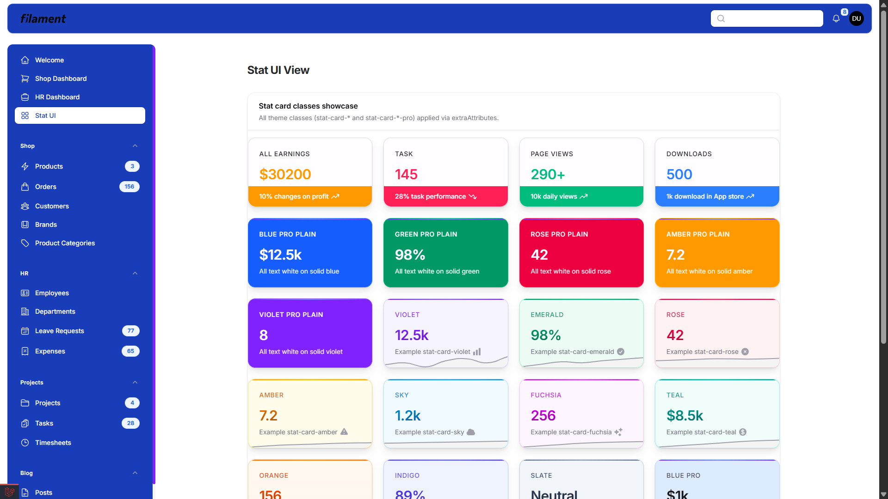 | 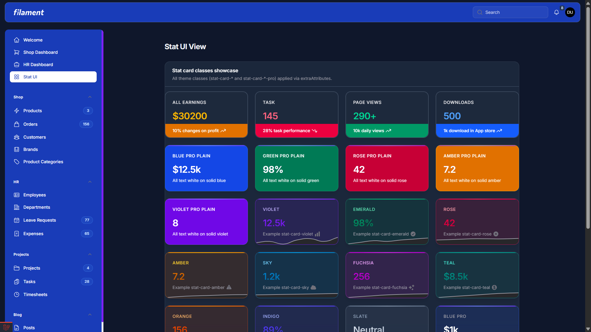 |

### 2 — HR Dashboard

| Light | Dark |
|-------|------|
| 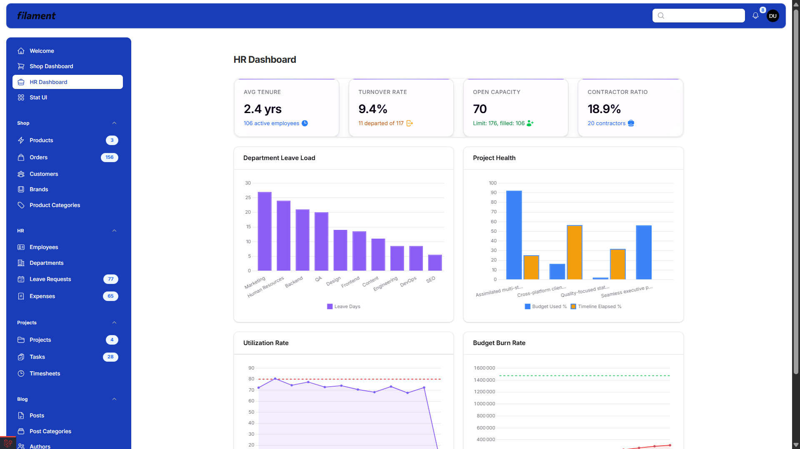 | 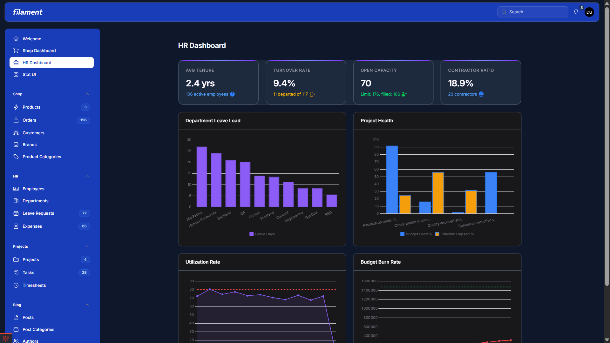 |

### 3 — Stat UI View (stat card showcase)

| Light | Dark |
|-------|------|
| 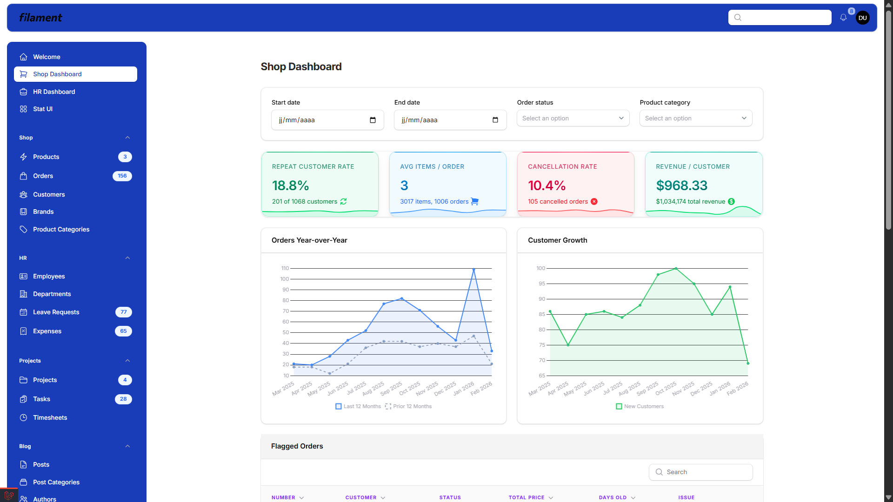 | 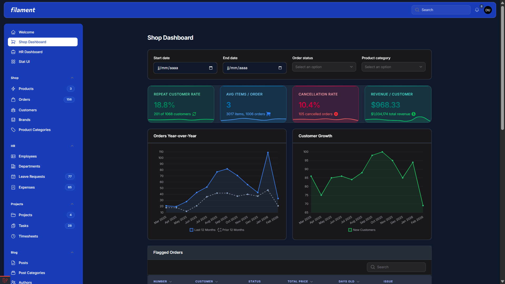 |

### 4 — Stat cards grid (all theme classes)

| Light | Dark |
|-------|------|
| 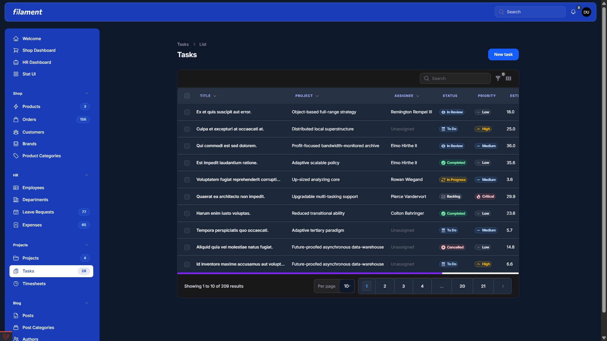 | 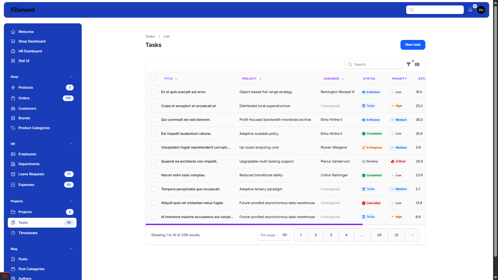 |

### 5 — Notifications and stat cards

| Light | Dark |
|-------|------|
| 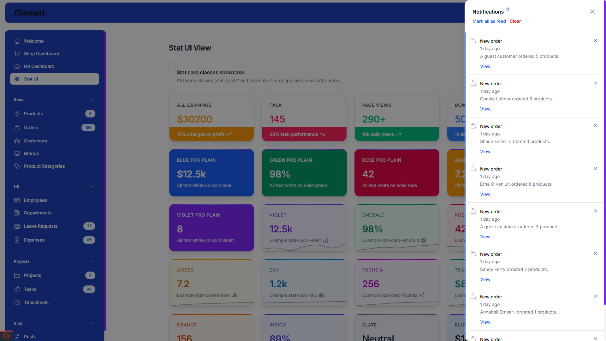 | 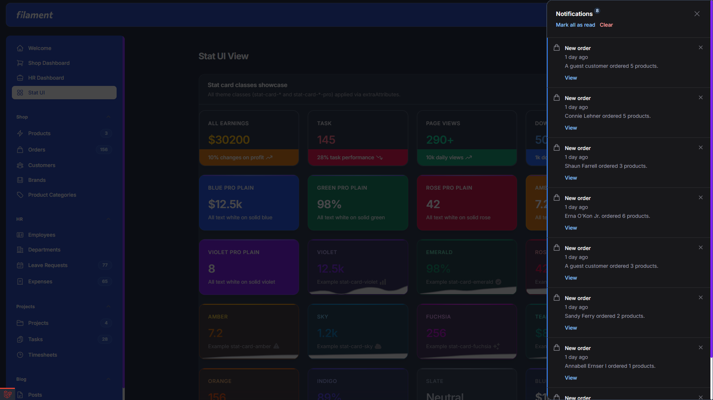 |

---

## License

Proprietary. Use is subject to the license provided with your purchase.
